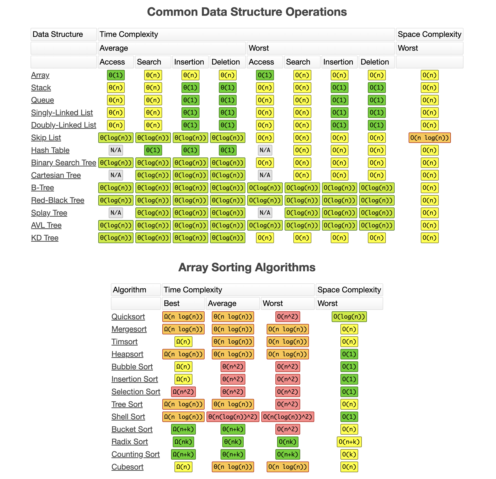

# Big O Notation

## Resources

### YouTube Videos
- [Big-O Notation in 100 Seconds — Fireship](https://www.youtube.com/watch?v=g2o22C3CRfU)

### Docs & Cheatsheets
- [Big-O Cheat Sheet](https://www.bigocheatsheet.com/)
- [Time Complexity — Wikipedia](https://en.wikipedia.org/wiki/Time_complexity)

---

## What is Big O?

Big O is a way to measure **how fast your code is under scale** — how the runtime grows as the input gets bigger.

It doesn't care about seconds or milliseconds. It cares about the *shape* of the growth.

## The Stadium Analogy

Imagine you're looking for your friend in a crowded stadium.

- **No info?** You check every seat one by one until you find them. If the stadium has `n` seats, that's `n` checks. → **O(n)** — *linear time*.
- **You know the exact row and seat?** You walk straight to it. Doesn't matter if the stadium has 10 seats or 10 million — same speed. → **O(1)** — *constant time*.

That's the entire intuition.

## Why It Matters

When your app has 10 users, almost any algorithm works fine.

When it scales to **millions of users**:
- An **O(n)** algorithm will melt your server.
- An **O(1)** algorithm stays lightning fast.

Big O is how engineers predict whether code will survive scale **before** it explodes in production.

## The Common Complexities

From fastest to slowest:

| Big O | Name | Example |
|-------|------|---------|
| **O(1)** | Constant | Looking up a value in a hash map / dictionary |
| **O(log n)** | Logarithmic | Binary search in a sorted array |
| **O(n)** | Linear | Looping through a list once |
| **O(n log n)** | Linearithmic | Efficient sorting (merge sort, quicksort) |
| **O(n²)** | Quadratic | Nested loop over the same list |
| **O(2ⁿ)** | Exponential | Naive recursive Fibonacci |
| **O(n!)** | Factorial | Generating every permutation |

## Cheatsheet — Data Structures & Sorting Algorithms

The complexities you'll actually be asked about in interviews, all in one place:



A few takeaways worth memorizing:

- **Hash Table** — O(1) average for insert/search/delete. This is why dictionaries/maps are everywhere.
- **Array** — O(1) access by index, but O(n) to search or insert in the middle.
- **Linked List** — O(1) insert/delete at the ends, but O(n) to access or search.
- **Balanced Trees (AVL, Red-Black, B-Tree)** — O(log n) for everything. The reason databases use B-Trees for indexes.
- **Quicksort / Mergesort / Heapsort** — O(n log n) average. The gold standard for general-purpose sorting.
- **Bubble / Insertion / Selection Sort** — O(n²). Easy to write, but never use them on real data at scale.

> Source: [bigocheatsheet.com](https://www.bigocheatsheet.com/)

## Quick Code Examples

```python
# O(1) — constant: one operation no matter the input size
def first_item(items):
    return items[0]

# O(n) — linear: one pass through the input
def contains(items, target):
    for item in items:
        if item == target:
            return True
    return False

# O(n²) — quadratic: nested loop over the input
def has_duplicates(items):
    for i in items:
        for j in items:
            if i == j and i is not j:
                return True
    return False
```

## How to Think About It

Ask yourself: **"If I double the input, what happens to the work?"**

- Stays the same → **O(1)**
- Doubles → **O(n)**
- Quadruples → **O(n²)**
- Barely changes → **O(log n)**

## TL;DR

Big O measures how your code's runtime grows with input size. **O(1)** is instant no matter the size, **O(n)** grows with the input, **O(n²)** explodes fast. It's the language engineers use to talk about performance at scale — and it's literally that simple.
