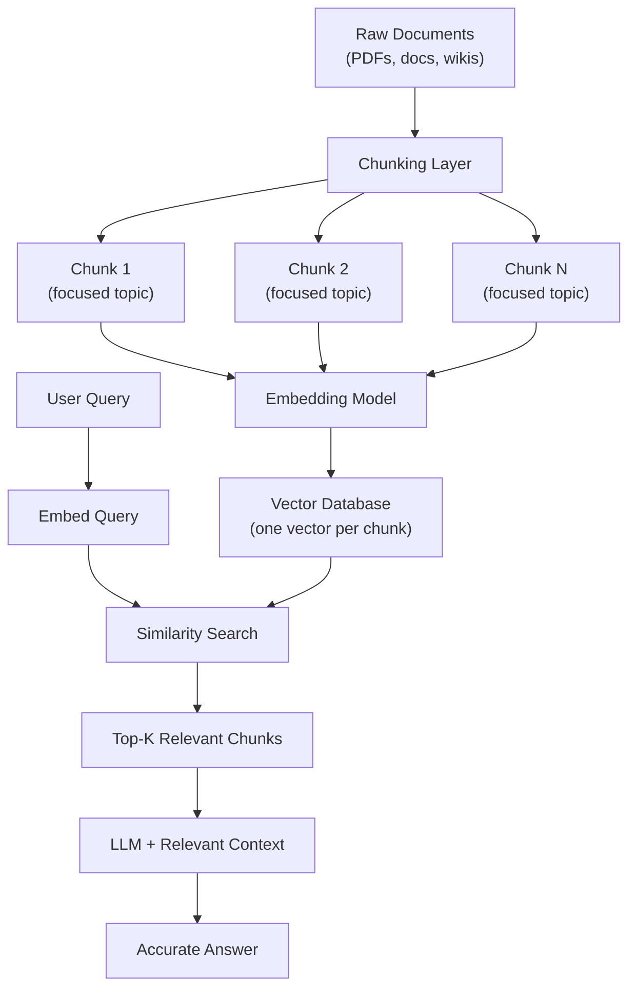

# RAG Chunking Strategy

---

## The Interview Question

> "Design a RAG chatbot for our company's internal documentation."

Most candidates immediately think: embed the documents, store them in a vector database, retrieve on query, pass to the LLM. Done.

But the follow-up kills them:

> "How does a single vector accurately represent 50 pages of entirely different topics?"

It doesn't. And that's the entire problem.

---

## Why Dumping Full Documents Fails

Imagine you take a 50-page employee handbook — it covers onboarding, PTO policy, expense reports, security protocols, and performance reviews — and you create **one embedding** for the entire thing.

That single vector has to represent all of those topics at once. It's like asking someone to summarize five completely unrelated books into a single sentence. The result is a vague, diluted blob that doesn't meaningfully represent any of the topics.

Now a user asks: "What's the policy for carrying over unused PTO?"

The similarity search compares their question against your diluted vectors. The embedding for the full document is equally distant from everything, so:

1. The wrong document gets retrieved (or the right document ranks low)
2. The LLM receives a wall of irrelevant text as context
3. The model either hallucinates an answer or pulls from the wrong section

This is the #1 reason RAG systems fail in production.

---

## What Chunking Actually Solves

Chunking breaks documents into smaller, focused pieces **before** embedding. Each chunk gets its own vector that tightly represents a specific idea or section.

Without chunking:
```
[50-page document] → 1 diluted embedding → bad retrieval
```

With chunking:
```
[50-page document] → 200 focused chunks → 200 precise embeddings → accurate retrieval
```

When the user asks about PTO policy, the similarity search now finds the exact chunk that discusses PTO — not a vague blob representing the entire handbook.

---

## Chunking Strategies (Simple to Advanced)

### 1. Fixed-Size Chunking

Split every N characters or tokens regardless of content.

```
Chunk 1: characters 0–500
Chunk 2: characters 501–1000
Chunk 3: characters 1001–1500
```

**Pros:** Dead simple to implement.
**Cons:** Cuts sentences in half. Splits ideas mid-thought. No respect for document structure.

### 2. Sentence/Paragraph Chunking

Split on natural boundaries — sentence endings, paragraph breaks, or newlines.

**Pros:** Preserves complete thoughts.
**Cons:** Paragraphs vary wildly in size. Some are too small to be useful, others too large.

### 3. Semantic Chunking

Group sentences together based on meaning similarity. When the topic shifts, start a new chunk.

```
Sentences about PTO policy → Chunk A
Sentences about expense reports → Chunk B
Sentences about security protocols → Chunk C
```

**Pros:** Each chunk represents a coherent topic. Best retrieval accuracy.
**Cons:** More complex to implement. Requires an embedding model to detect topic boundaries.

### 4. Recursive/Hierarchical Chunking

Try to split on the largest boundary first (sections → paragraphs → sentences → characters). Only go smaller when a chunk exceeds the size limit.

**Pros:** Respects document structure. Balanced chunk sizes.
**Cons:** Depends on documents having consistent formatting.

---

## Why Overlap Matters

Even with good chunking, you lose context at boundaries. A sentence at the end of chunk 4 might complete a thought that started in chunk 5.

**Text overlap** solves this — each chunk includes a few sentences from the previous chunk:

```
Chunk 1: [sentences 1–10]
Chunk 2: [sentences 8–17]  ← overlaps with chunk 1
Chunk 3: [sentences 15–24] ← overlaps with chunk 2
```

This way, ideas that span chunk boundaries still get captured. In production, 10–20% overlap is a common starting point.

---

## How This Looks in a Production RAG Pipeline



The chunking layer is where all the intelligence lives. Get it wrong, and the rest of the pipeline can't save you — you're feeding garbage context to the LLM.

---

## Production Considerations

| Decision | What to think about |
|----------|-------------------|
| **Chunk size** | Too small = chunks lose context. Too large = embeddings get diluted. 256–1024 tokens is a common range. |
| **Overlap size** | 10–20% of chunk size. Enough to preserve boundary context without exploding storage. |
| **Metadata** | Store source document, page number, section title with each chunk. Critical for citations and debugging. |
| **Chunking per doc type** | PDFs, Markdown, HTML, and code all need different splitting logic. One strategy rarely fits all. |
| **Re-chunking** | When documents update, you need to re-chunk and re-embed. Plan for this in your pipeline. |
| **Evaluation** | Measure retrieval recall — are the right chunks being returned? Fix chunking before tuning the LLM. |

---

## The Key Insight

RAG doesn't fail because the LLM is bad. RAG fails because the **retrieval** is bad. And retrieval is bad because the **chunking** is bad.

The LLM can only work with what you give it. If you feed it the right 3 paragraphs, it gives you a perfect answer. If you feed it 50 pages of noise, it hallucinates.

Smart chunking is the difference between a RAG chatbot that actually works in production and one that confidently makes things up.

---

## TL;DR

Don't dump full documents into a vector database. Break them into small, semantically meaningful chunks with overlap. Each chunk gets its own embedding that tightly represents one idea. When a user asks a question, the system retrieves the exact relevant chunks — not a wall of text — and the LLM produces an accurate, grounded answer. Chunking strategy is the #1 lever for RAG quality.
